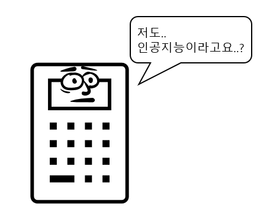
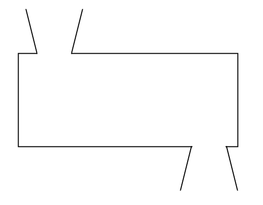
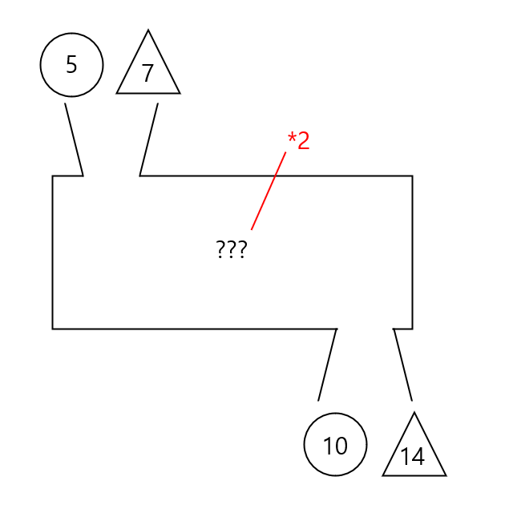

## 들어가며
안녕하세요! 최근 OpenAI의 ChatGPT를 필두로 하여 AI라는 새로운 파도가 우리에게 다가오고 있고 많은 사람들이 이에 대해 기대를 하기도, 걱정을 하기도 합니다. 

이 파도를 활용해 서핑을 하던, 이 파도를 대비해 방파제를 짓던 제일 중요한 것은 우리에게 다가오는 이 파도에 대해 잘 아는 것입니다.

이 연재 시리즈에서는 아카이시 마사노리의 '딥러닝을 위한 수학 (2020)' 책을 바탕으로, 인공지능에서 활용되는 수학에 대해 알아보고자 합니다.

## 인공지능이 뭐야?

우선 인공지능이라는게 뭘까요? 말 그대로 해석하면 됩니다. 인공적으로 만들어진 지능이라는 뜻입니다.

그런데 여기서 '인공적' 이라는 것과 '지능' 이라는 것을 정의하기가 어렵습니다. 

사실 우리의 지능은 날 때부터 모두 다 갖고 태어나는 것은 아닙니다. 인공적인 학습과 경험들이 모여가며 만들어지는 것이죠.

그리고 지능은 또 무엇일까요? 아래는 지능에 대해 여러 기관, 사람들이 정의한 내용입니다.

> 지능이란 세상에서 목표를 성취하는 능력의 계산적인 부분이다.
>
> -----
> John McCarthy, What is AI?, 1998

> 지능: 특정 지식이나 기술을 획득하고 적용할 수 있는 능력
>
> -----
> Oxford English Dictionary

> 문제를 찾아서 해결하는 기술 또는 무언가를 창조하는 능력
>
> -----
> 하워드 가드너 (미국의 발달 심리학자)

> 생존 환경의 변화에 적응하기 위해 인지적 기능을 변화시키는 인간 고유의 능력
>
> -----
> 뢰벤 포이어스타인 (이스라엘의 심리학자)

> 자신의 감정이나 다른 사람의 감정을 잘 읽어내는 능력 또한 지능에 속한다.
>
> -----
> 피터 샐로비 (EQ의 개념을 정립한 미국 예일대 교수)

이렇듯 머신러닝, 딥러닝과는 달리 인공지능이라는 표현은 다분히 인문학적인 개념으로 들어갑니다.

마치 AR, VR은 공학적으로 다소 명확히 정의되어 있고, 메타버스는 사람마다 무엇을 지칭하는지 다 다른 것 처럼 말이죠.

인공지능도 마찬가지입니다. 사실 기존의 규칙기반, 예를 들어 한글과 컴퓨터에서 오타가 나면 빨간 줄을 그어주는 시스템 또한 인공지능의 범주에 포함될 수 있습니다. 더 나아가서 계산기나 자판기도 인공지능으로 볼 수 있습니다.

그런데 우리가 흔히 AI라고 하면서 계산기를 말하지는 않죠. 이번 시리즈에서는 책과 마찬가지로 인공지능을 '__머신러닝을 활용해__ 인공적으로 구현한 지능 시스템'으로만 한정해서 다루도록 하겠습니다.

## 머신러닝은 뭔데?
이 책에서는 머신러닝을 다음 두 가지 원칙을 만족하는 시스템이라고 보고 있습니다.

> - 원칙 1: 머신러닝 모델은 입력 데이터가 주어질 때 출력 데이터를 반환하는 함수와 같은 기능이 있다.
>
> - 원칙 2: 머신러닝 모델의 행동은 학습으로 결정된다.

음.. 한번에 바로 와닿기에는 쉽지 않을 수 있습니다. 제가 조금 더 풀어서 설명을 드려볼게요.

옛날에 초등~중학교 수학시간에 아래 그림을 보신 기억이 있으신가요?

아래와 같이 5가 들어가면 10이 나오고, 7이 들어가면 14가 나오는 상자가 있습니다.
여기서 5, 7에 해당하는 부분이 원칙 1에서 말하는 '입력 데이터',
10, 14에 해당하는 부분이 '출력 데이터' 라고 생각하시면 됩니다.

